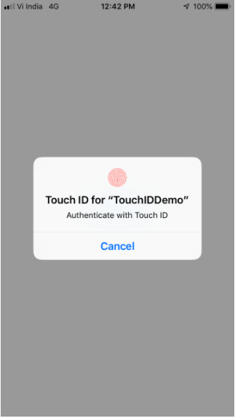

# TouchID

## Description

Follow the tutorial to learn how to use Touch ID functionality in iOS Application using Swift. [Medium.com](https://medium.com/@rohittamkhane/touch-id-authentication-in-swift-d5b6f23eca2c)

## Screenshots

